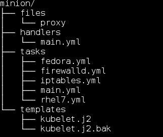

##安装，配置

在linux操作系统下装，以下redhat/centos系统为例子:

从YUM/APT源安装:

```#yum install ansible```

```#aptitude(apt-get) install ansible```

使用源代码安装:
```
$git clone git://github.com/ansible/ansible.git --recursive
$cd ./ansible
$source ./hacking/env-setup
```
如果source出错：

```$ source ./hacking/env-setup -q```

安装pip,如果已经安装，跳过这一步

```#sudo easy_install pip```

安装python模块：

```#sudo pip install paramiko PyYAML Jinja2 httplib2```

更新ansible 内建模块代码:
```
$git pull --rebase
$git submodule update --init --recursive
```

配置inventory
> 将需要管理的主机加入到``/etc/ansible/hosts``下

```
[webservers]
alpha.example.org
beta.example.org
192.168.1.100
192.168.1.110

# If you have multiple hosts following a pattern you can specify
# them like this:

www[001:006].example.com
```

ping测试(ask-pass需要输入密码):

```$ansible all -m ping --ask-pass```
```
192.168.1.131 | success >> {
    "changed": false,
    "ping": "pong"
}

192.168.1.133 | success >> {
    "changed": false,
    "ping": "pong"
}
```

##Ad-hoc(master管理多台minion)

执行shell命令:
```
- $ansible all -a 'ifconfig eth0'
- $ansible all -a '/sbin/reboot' -f 10
- $ansible all -a '/usr/bin/foo'-u <username>
- $ansible all -a '/usr/bin/foo' -u <username> --sudo [--ask-sudo-pass]
- $ansible all -m shell -a 'echo $TERM'
```
文件传输:
```
- $ansible host1 -m copy -a "src=/etc/hosts dest=/tmp/hosts"
- $ansible webservers -m file -a "dest=/srv/foo/b.txt mode=600 owner=mdehaan group=mdehaan"
- $ansible webservers -m file -a "dest=/path/to/c state=absent"(删除/path/to/c)
```
包管理：
```
- $ansible webservers -m yum -a "name=acme state=latest"
- $ansible webservers -m yum -a "name=acme state=absent"(删除包)
```
用户管理：
```
- $ansible all -m user -a "name=foo password=<crypted password here>"
- $ansible all -m user -a "name=foo state=absent"(删除用户)
```
##Playbooks

基本文件结构目录：(files, handlers, tasks, templates)



###files

预先编写好的文件，将直接发送到服务器,如nginx服务的配置文件

###handlers

定义一些基础操作，如服务停止，重启等
```
- name: restart nginx
  service: name=kube-proxy state=restarted

- name: restart iptables
  service: name=iptables state=restarted

- name: restart docker
  service: name=docker state=restarted

```

###tasks
任务编写：
```
---
- include: fedora.yml
  when: is_rhel7.rc != 0

- include: rhel7.yml
  when: is_rhel7.rc == 0

# 0.7版后官方建议写法，0.7之前将template换成action
- name: write the config files for kubelet
  template: src=kubelet.j2 dest=/etc/kubernetes/kubelet
  notify:
          - restart kubelet

- name: write the config files for proxy
  copy: src=proxy dest=/etc/kubernetes/proxy
  notify:
          - restart proxy

- name: Enable cadvisor
  service: name=cadvisor enabled=yes state=started

- name: Enable kubelet
  service: name=kubelet enabled=yes state=started

- name: Enable proxy
  service: name=kube-proxy enabled=yes state=started

- include: firewalld.yml
  when: has_firewalld.rc == 0

- include: iptables.yml
  when: has_firewalld.rc != 0 and has_iptables.rc == 0

```

###templates
含变量的file,如kubelet.j2
```
###
# kubernetes kubelet (minion) config

# The address for the info server to serve on (set to 0.0.0.0 or "" for all interfaces)
KUBELET_ADDRESS="--address={{ ansible_all_ipv4_addresses }}"

# The port for the info server to serve on
KUBELET_PORT="--port=10250"

# You may leave this blank to use the actual hostname
KUBELET_HOSTNAME="--hostname_override={{ ansible_all_ipv4_addresses }}"

# Add your own!
KUBELET_ARGS=""

```
###执行playbook

应用某个配置：

```$ansible-playbook playbook.yml```

查看playbook对每台主机执行情况，但实际不执行任何操作

```$ansible-playbook playbook.yml --list-hosts```


